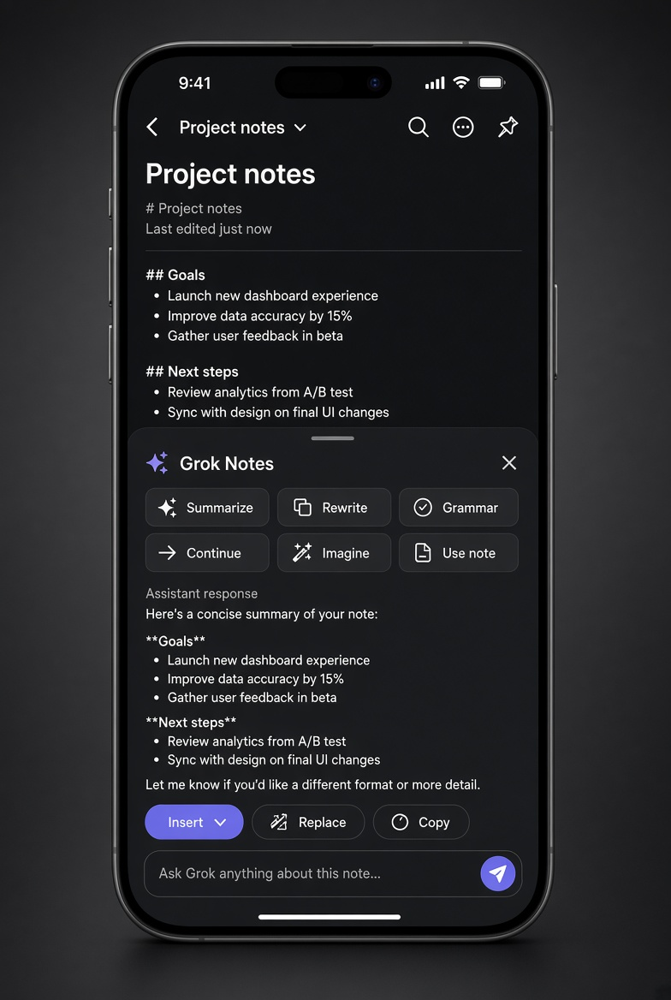
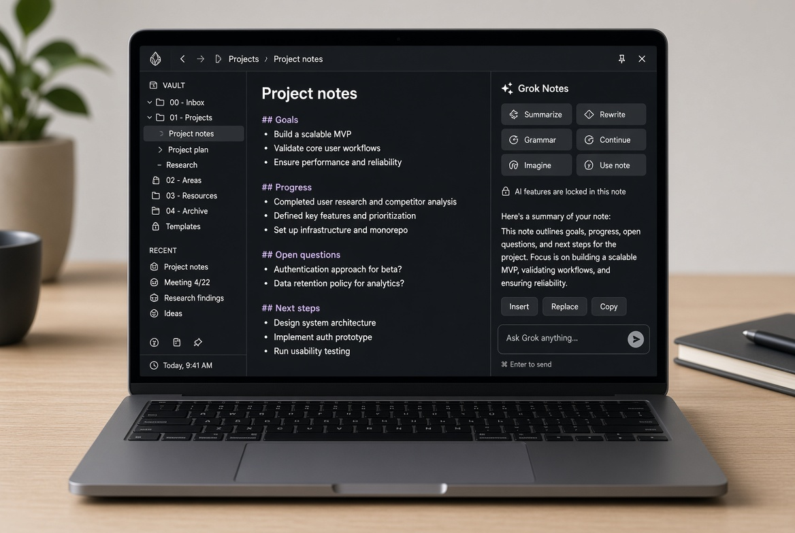

# Phone and laptop

The same plugin runs on desktop, tablet, and phone. `isDesktopOnly` is false. The layout changes so the phone UI is tappable.

## Laptop and tablet

Auto layout opens a sidebar. Replies can stream. Finished replies render as Markdown. While tokens are arriving, the reply stays plain text so the pane does not jump.

Select text, then right click **Ask Grok about selection**.

## Phone

Auto layout opens a full-width sheet. Phone waits for the full reply. Mobile drops a stream, so the request is non-streaming.

Summarize keeps the open note even when the editor is not active. Quick actions ask Grok 4.7 for a short think (`reasoning_effort: low`) so the token budget is not spent before the summary.

## Layout setting

Settings → Grok Notes → Chat layout:

- Auto — sidebar on desktop and tablet, sheet on phone
- Always sidebar
- Always popup sheet

Use always sheet if you want the phone layout on a laptop. Use always sidebar only on a wide screen.
